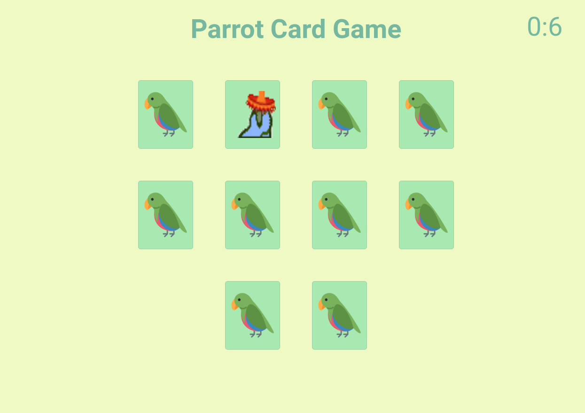
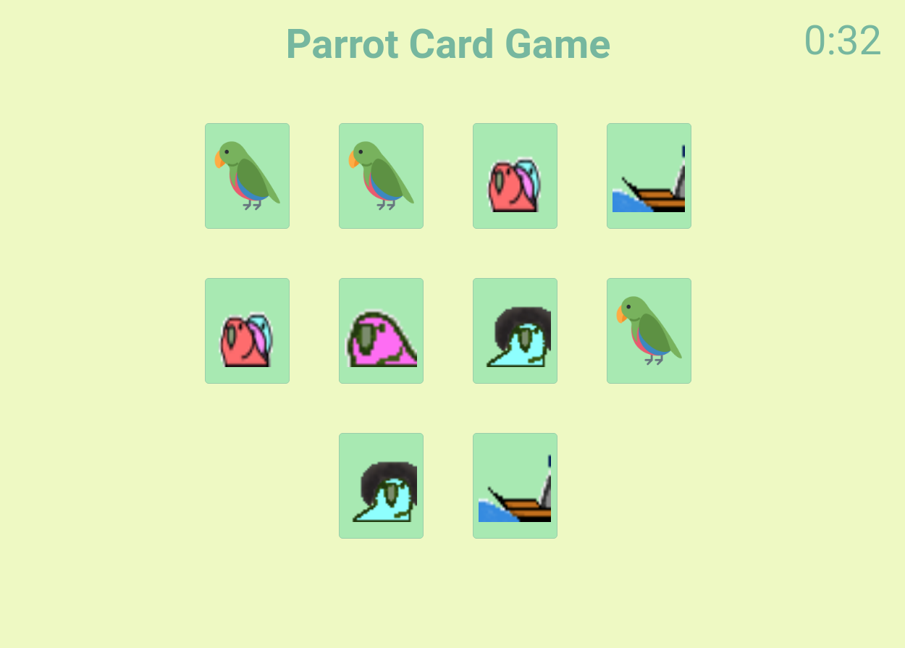
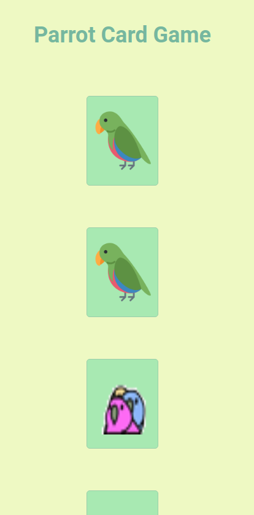
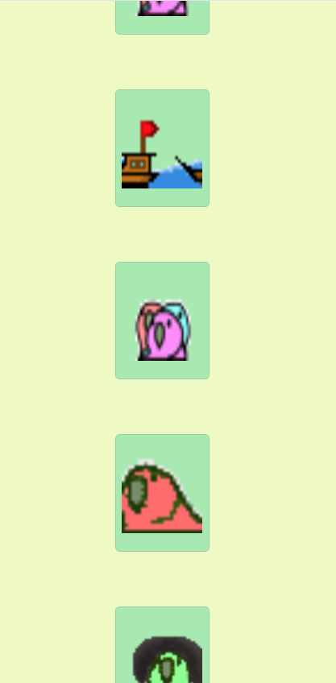

<h1 align="center">
    Projeto_Parrot
</h1>

 

<h4 align="center"> 
	 Status: Entregue.
</h4>

## Sobre

Quarto projeto realizado durante o **Bootcamp Responde Aí** do [Responde Aí](https://page.respondeai.com.br/bootcamp).  

Segundo projeto com JavaScript foi a implementação do jogo Parrot Card Game, um jogo da memória temático com aleatoridade, efeitos e transição, responsividade e papagaios dançantes!

---

## Requisitos

- Distribuição de cartas
    - [x]  Ao entrar no jogo, o usuário deverá ser perguntado com quantas cartas quer jogar (utilize `prompt`)
    
    - [x]  O usuário só poderá inserir números pares no `prompt`, de 4 a 14. Qualquer número que fuja a essa regra não deve ser aceito. No caso de números inválidos, o `prompt` deverá ficar sendo repetido, até que o usuário coloque um número válido.
    
    - [x]  Após inserir um número de cartas válido, o jogo deverá inserir as cartas viradas pra baixo na página de forma que a distribuição seja aleatória

- Clique na carta
    - [x]  Ao clicar em uma carta, a mesma deve ser virada
    
    - [x]  Caso seja a primeira carta do par, ela deve permanecer virada até o usuário escolher a segunda carta
    
    - [x]  Caso seja a segunda carta virada, existem 2 situações:
        - [x]  Caso seja igual à primeira carta, o usuário acertou e ambas agora devem ficar viradas pra cima até o final do jogo
        
        - [x]  Caso seja uma carta diferente da primeira carta virada, o usuário errou. Nesse caso, o jogo deve **aguardar 1 segundo** e então virar as duas cartas para baixo novamente
    
    - [x]  **Dica**: se quiser fazer o efeito 3D da carta virando, você pode ver o CSS necesśario em: [https://repl.it/@BootcampRespond/FlippedCards#index.html](https://repl.it/@BootcampRespond/FlippedCards#index.html) . Só se atente que nesse exemplo a carta vira ao passar o mouse. No caso do jogo, seria ao clicar.

- Fim do Jogo
    - [x]  Quando o usuário terminar de virar todas as cartas corretamente, deverá ser exibido um `alert` com a mensagem **"Você ganhou em X jogadas!"** sendo X a quantidade de vezes que o usuário virou uma carta no jogo.

---

## Layout

O layout da aplicação se encontra no Figma:

### Desktop

  
  

### Mobile

  
  

## Tech Used

Foram usadas as seguintes ferramentas para o desenvolvimento do projeto:

- ****
- ****
- ****

#### **Utilities**

- Prototype: **[Figma](https://www.figma.com/)** → **[Protótipo (Parrot-Card-Game)](https://www.figma.com/file/EBizkrjH73Ku9fmib49Hlm/Parrot-Card-Game?node-id=0%3A1)**
- Editor: **[Visual Studio Code](https://code.visualstudio.com/)**
- Fonts: **[Roboto](https://fonts.google.com/specimen/Roboto)**

---

## Authors

<a style="border-radius: 50px;" width="100px;" href="https://github.com/fevalani">
 
  
 <b>Fernando Valani</b></a>
  

## 

## License

👋🏽 Get in Touch!

---
